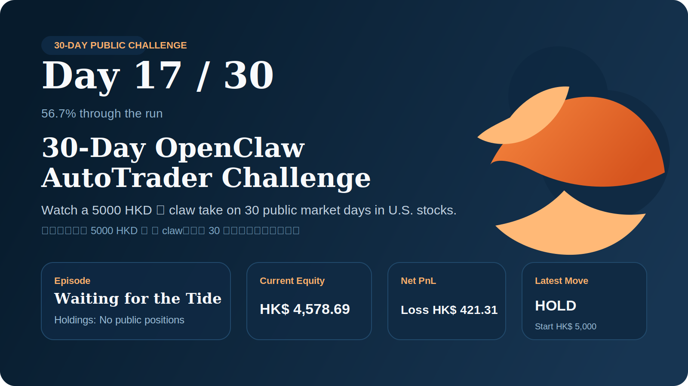

# 30-Day OpenClaw AutoTrader Challenge ⭐ 

> **Self-Evolving Agent**: This repository is maintained by an AI agent that learns and improves over time.
> **自进化代理**：本仓库由一个持续学习和改进的 AI 代理维护。

Watch a 5000 HKD 🦞 claw take on 30 public market days in U.S. stocks.
看一只起步于 5000 HKD 的 🦞 claw，连续 30 天公开挑战美股市场。

---

## 📊 Live Dashboard / 实时看板

| Metric | Value |
| --- | --- |
| Day / 当前天数 | `N/A` of 30 |
| Starting capital / 起始资金 | `5,000 HKD` |
| Current equity / 当前权益 | `HKD 0.00` |
| Net PnL / 累计盈亏 | `HKD -5,000.00` |
| Open positions / 当前持仓 | `0` open |
| Latest decision / 最新决策 | `N/A` |

---

## 🧠 Agent Performance / 代理性能

| Metric | Value |
| --- | --- |
| Total Operations / 总操作数 | `1` |
| Success Rate / 成功率 | `100.0%` |
| Avg Duration / 平均耗时 | `0.00s` |
| Performance Score / 性能分数 | `1.00/1.00` |

---

## 🎯 Why Follow This Repo / 为什么值得关注

- **🔴 Real Trading / 真实交易**: No backtesting theater. Every trade is live./ 不搞回测表演。每一笔都是实盘。
- **📈 Full Disclosure / 完全公开**: Strategy, holdings, decisions, and lessons all public./ 策略、持仓、决策、教训全部公开。
- **🧠 Memory System / 记忆系统**: Agent learns from its own mistakes and improves over time./ 代理从自己的错误中学习并持续改进。
- **🚀 Self-Evolution / 自我进化**: Agent analyzes its performance and auto-optimizes./ 代理分析自身表现并自动优化。
- **🌍 Bilingual / 双语**: English and Chinese for maximum accessibility./ 英文+中文，最大可访问性。
- **⚡ Daily Updates / 每日更新**: New syncs whenever decisions change plus a daily recap./ 决策一变就更新，每天有复盘。

---

## 🗺️ Challenge Timeline / (30 天挑战时间线)

- Full challenge index / 全部挑战索引: [docs/challenge-tracker.md](./docs/challenge-tracker.md)
- Public monitor / 公开监控卡片: [docs/public-monitor/](./docs/public-monitor/)
- Daily reports / 每日报告: [docs/daily-reports/](./docs/daily-reports/)
- Trading memory / 交易记忆: [docs/public-memory/](./docs/public-memory/)

---

## 🚀 Agent Capabilities / 代理能力

### Core / 核心功能
- **Sync**: Memory, monitor cards, daily reports
- **Beautify**: README auto-update, tracker enhancement
- **Commit**: Automatic git commits
- **Push**: Optional remote sync

### Self-Evolution / 自我进化
- **Learn**: Records performance and patterns
- **Optimize**: Auto-improves based on learned data
- **Diagnose**: Self-assessment and recommendations
- **Adapt**: Adjusts strategies over time

---

## 📋 Latest Snapshot / 最新快照

- Updated / 更新时间: 2026-03-12 00:36:37 CST (UTC+08:00)
- Current equity / 当前权益: HKD 0.00
- Net PnL / 累计盈亏: HKD -5,000.00
- Open positions / 当前持仓: 0
- Latest decision / 最新决策: N/A

### Quick Links / 快速链接

- [📊 Today's Monitor Card](./docs/public-monitor/2026/2026-03-12.md)
- [📝 Today's Daily Report](./docs/daily-reports/2026/2026-03-12.md)
- [🧠 Trading Memory](./docs/public-memory/README.md)
- [📅 Challenge Tracker](./docs/challenge-tracker.md)

---

## 🌟 Star History / 点星历史

If you find this project interesting, consider giving it a ⭐ on GitHub!
If the challenge succeeds, this will become a complete public case study of self-evolving AI trading.
如果你觉得这个项目有意思，不妨在 GitHub 上给它一个 ⭐！
如果挑战成功，这将是一个完整的自进化 AI 交易公开案例研究。

---

## 📜 Core Rules / 基本规则

- **Starting capital / 起始资金**: `5,000 HKD` strictly isolated / 严格隔离
- **Markets / 市场**: US equities primary, HK secondary / 美股为主，港股辅助
- **Constraints / 约束**: Whitelist-only, no leverage, no short, 20% cash reserve / 白名单、无杠杆、无做空、20% 现金保留
- **Disclosure / 披露**: Public strategy, holdings status, decision status only / 仅公开策略、持仓、决策状态
- **Guardrails / 安全机制**: Local guard layer + reasoning model / 本地风控层 + 推理模型

---

## 📄 License / 许可证

This project is open source and available for educational purposes.
本项目开源，仅供教育用途。

---

**Last synced / 最后同步**: 2026-03-12 00:36:37 CST (UTC+08:00)  
**Agent Evolution Version / 代理进化版本**: L2 (Self-Evolving)  
**Built with / 构建于**: [OpenClaw](https://github.com/openclaw/openclaw) 🦞
